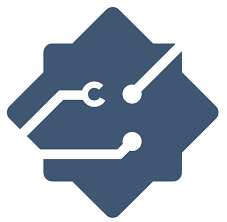
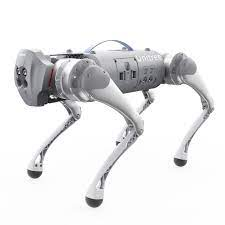

# I-RIM Dog Challenge 

- Version 1.0.0

---


A repository for I-RIM DOG Challenge. Here you can find the simulation environment used for testing and deployment for the Locomotion Track 

- Maintainer status: maintained
- Maintainers
  - Michele Focchi
  - Andrea Pupa


</div>
<div style="flex:40%; padding-left:10px;">

**Table of Contents**
- [Overview](#overview)
- [Usage of the framework](#usage-of-the-framework)

</div>
</div>

---

## Overview




This repository provides framework and the URDF for the challenge for simulation 

- You can find detailed informations about the challenge on the <a href="docs/rule.md">rule page </a>
- The supported robot for this simulation is Go1 from Unitree robotics. A real prototype of the robot (EDU version) is provided from EagleProjects to the teams that might need it but you are free to use your own quadruped platform.




---

## Usage of the framework

The map with of the race (with obstacles) is with the **locomotion.world** file. You can download and check map overview from <a href="docs/infographics.pdf" download>here</a>. 

The goal is to overpass all obstacles and reach the final destination in the shortest time possible. For details on the rule of the game, refer to the <a href="docs/rules.md">rule page </a> If you want to use the Go1 robot you can use this  [URDF description](https://github.com/graiola/wolf_descriptions). For any clarification please open a Github issue on this repository. 

The obstacles are of different nature and are designed to test different robot capabilities:

1. Stairs
2. Gap 
3. Narrow passage
4. Cluttered passage: the robot needs to walk belly down to pass underneath 
5. Holes in the terrain
6. Stepping Stones
7. Pile of rubble
8. Soft foam/ deformable terrain
9. Big ramps with change of inclination
10. Omni-directional small ramps

To load (in a Gazebo simulator) the  map contained in **worlds/locomotion/locomotion.world**: 

- Append these commands in your .bashrc

```
export GAZEBO_MODEL_PATH=$GAZEBO_MODEL_PATH:$HOME/DogChallengeFolder/models
export GAZEBO_PLUGIN_PATH=$GAZEBO_PLUGIN_PATH:$HOME/DogChallengeFolder/plugins/lib
export GAZEBO_RESOURCE_PATH=$GAZEBO_RESOURCE_PATH:$HOME/DogChallengeFolder/worlds
```

where **DogChallengeFolder** is the folder where you cloned this repository

- Spawn Gazebo simulation with this command:

```bash
roslaunch dog_challenge locomotion.launch
```

In this version, we only provide a method to import an SDF environment in a gazebo simulation. Alternatively, you can use your own framework and code to load the map model.

 

